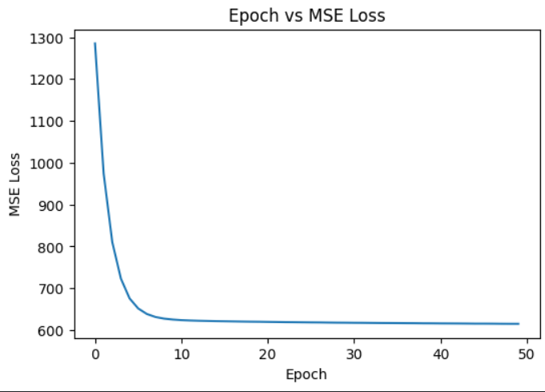
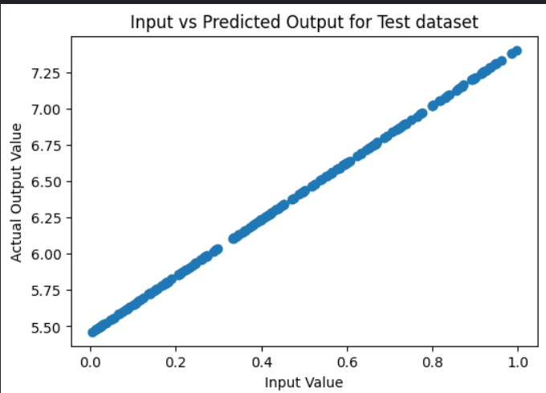

# Linear Regression from Scratch


A complete implementation of Linear Regression using only NumPy —
no scikit-learn, no shortcuts. Built to understand gradient descent
at a fundamental level, including a custom MSE loss function,
mini-batch training, and performance evaluation with R² score.

## Results

| Metric | Value |
|---|---|
| Learned weight (true: 2.0) | ~2.5 |
| Learned bias (true: 5.0) | ~4.72 |
| Test MSE | ~0.03 |
| Test R² score | ~0.90 |

### Loss curve


### Prediction vs actual


## What I implemented
- Mean Squared Error (MSE) loss function from scratch
- Mini-batch gradient descent with shuffled data
- 80/20 train/test split with reproducible seeding (np.random.seed)
- R² score for model evaluation
- Loss curve visualization across training epochs

## How to run

```bash
git clone https://github.com/Tayhan87/linear-regression-from-scratch
cd linear-regression-from-scratch
pip install -r requirements.txt
jupyter notebook linear_regression.ipynb
```

## Tech stack
- **Python 3.10**
- **NumPy** — all math and array operations
- **Matplotlib** — loss curve and scatter plots

## Key concept
The gradient descent update rule for each mini-batch:

```python
m = m - lr * (2/batch_size) * np.sum((y_pred - y_true) * x)
b = b - lr * (2/batch_size) * np.sum(y_pred - y_true)
```

## Part of a learning series
This is project 1 in my ML-from-scratch series.
- Project 1: Linear Regression (this repo)
- Project 2: Logistic Regression (coming soon)
- Project 3: CNN with PyTorch (coming soon)
